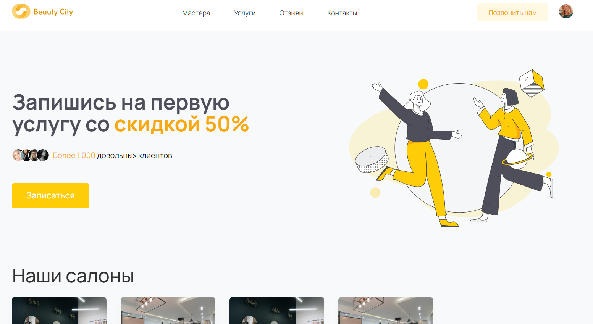
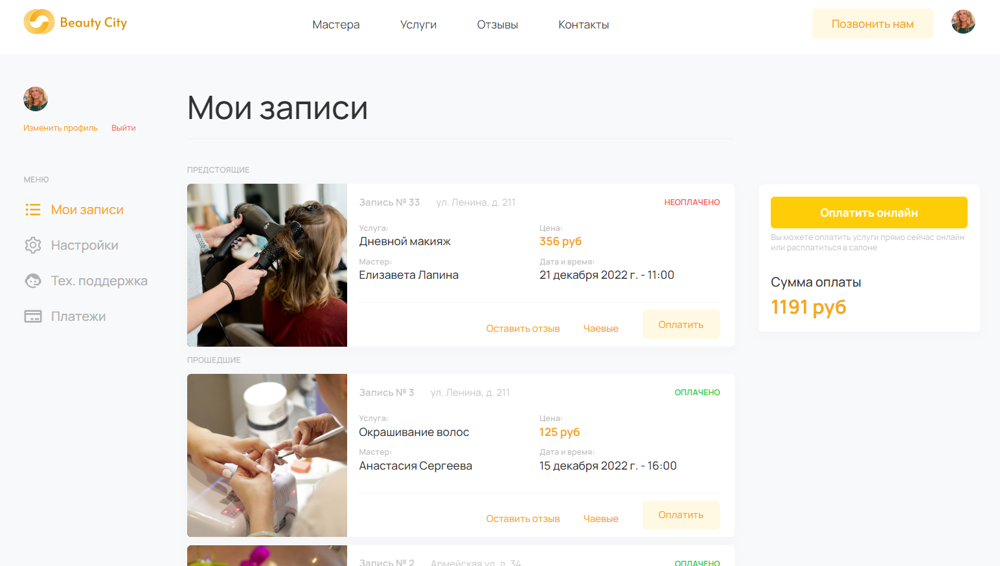
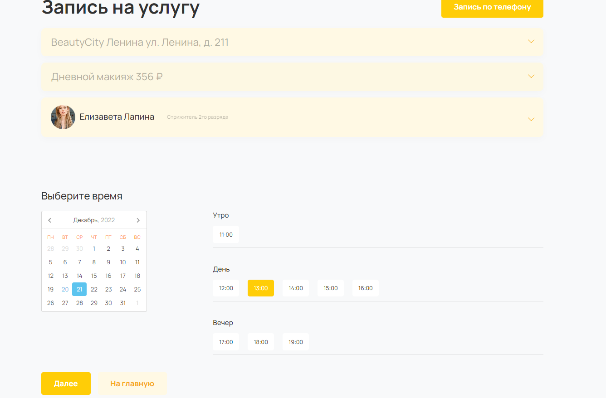
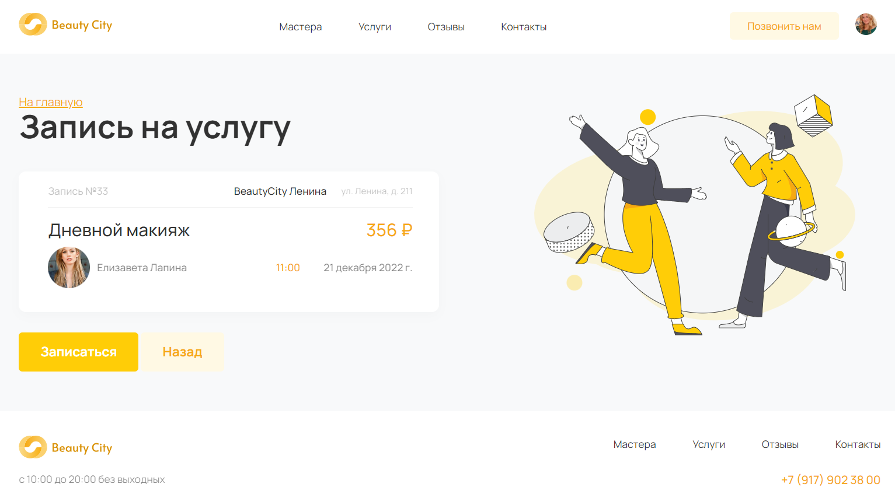

# Сайт салонов красоты Beauty City

Это сайт салонов красоты Beauty City.

Через сайт возможно ознакомиться со списком салонов/оказываемых услуг и с мастерами салонов.



Посмотреть свои прошедшие и предстоящие записи.



Также возможно записаться на определенное время на оказание услуги в салоне определенным мастером.





Сеть Beauty City объединяет несколько салонов, действующих под единой франшизой.
У всех салонов и мастеров одинаковые цены, но список оказываемых услуг у каждого мастера может быть свой.
Доступное свободное время одинаковое у каждого мастера, в один день мастер работает только в одном салоне, и он работает
в одном и том же салоне по одним и тем же дням недели.

На сайте есть два независимых интерфейса.

Первый — это публичная часть, где можно выбрать записаться на оказание услуги и посмотреть свои записи.

Второй интерфейс это админка. Преимущественно им пользуются программисты при разработке сайта. Также сюда заходит
администратор, чтобы добавить салон, мастера, услуги, а также указать, какие услуги оказывает мастера и по каким дням
недели в каком салоне он работает.

## Как запустить dev-версию сайта

Скачайте код.

Перейдите в каталог проекта:

```sh
cd beauty-service
```

[Установите Python](https://www.python.org/), если этого ещё не сделали.

Проверьте, что `python` установлен и корректно настроен. Запустите его в командной строке:

```sh
python --version
```

Возможно, вместо команды `python` здесь и в остальных инструкциях этого README придётся использовать `python3`. Зависит
это от операционной системы и от того, установлен ли у вас Python старой второй версии.

В каталоге проекта создайте виртуальное окружение:

```sh
python -m venv venv
```

Активируйте его. На разных операционных системах это делается разными командами:

- Windows: `.\venv\Scripts\activate`
- MacOS/Linux: `source venv/bin/activate`

Установите зависимости в виртуальное окружение:

```sh
pip install -r requirements.txt
```

Определите переменные окружения:

- `DJANGO_SECRET_KEY` — секретный ключ проекта. Он отвечает за шифрование на сайте. Например, им зашифрованы все пароли на
  вашем сайте.
- `DEBUG` — ОПЦИОНАЛЬНО, дебаг-режим. Поставьте `False` или `True`.
- `HOSTS` — ОПЦИОНАЛЬНО, [см. документацию Django](https://docs.djangoproject.com/en/3.1/ref/settings/#allowed-hosts)
- `INTERNAL_IPS` —
  ОПЦИОНАЛЬНО, [см. документацию Django](https://docs.djangoproject.com/en/3.1/ref/settings/#internal-ips)
- `STATIC_DIR_NAME` —
  ОПЦИОНАЛЬНО, [см. документацию Django](https://docs.djangoproject.com/en/3.1/ref/settings/#static-root)
- `WORKDAY_START_HOUR` — ОПЦИОНАЛЬНО, число, обозначающее во сколько ровно часов начинают работать салоны (10 часов утра
  по умолчанию)
- `WORKDAY_END_HOUR` — ОПЦИОНАЛЬНО, число, обозначающее во сколько ровно часов заканчивают работать салоны (в 20 часов
  по умолчанию)
  Создать файл `.env` в каталоге `beauty_city/` и положите туда такой код:

```sh
DJANGO_SECRET_KEY=django-insecure-0if40nf4nf93n4
```

Создайте файл базы данных SQLite и отмигрируйте её следующей командой:

```sh
python manage.py migrate
```

Запустите сервер:

```sh
python manage.py runserver
```

Откройте сайт в браузере по адресу [http://127.0.0.1:8000/](http://127.0.0.1:8000/).

## Администрирование

### Новый салон

1. Создайте салон в модели "Салон красоты", [относительный адрес](/admin/saloonapp/saloon/add/)
2. Свяжите с салоном мастера и его рабочие дни в модели "Расписание мастера по дням недели"
   , [относительный адрес](/admin/saloonapp/saloonmaster/add/)
   Повторить действие для каждого мастера, который будет работать в салоне.

### Новый мастер

1. Создайте мастера в модели "Мастер" (там же укажите его специализацию и оказываемые услуги)
   , [относительный адрес](/admin/saloonapp/master/add/)
2. Свяжите с салоном мастера и его рабочие дни в модели "Расписание мастера по дням недели"
   , [относительный адрес](/admin/saloonapp/saloonmaster/add/)
   Повторить действие для каждого салона, в котором будет работать мастер.

### Новая услуга

1. Создайте услугу в модели "Услуга", [относительный адрес](/admin/saloonapp/service/add/)
2. Свяжите услугу с мастером в модели "Мастер" [относительный адрес](/admin/saloonapp/master/) для каждого мастера,
   который будет оказывать услугу.

## Список требуемых улучшений/исправлений

1. Интеграция с сервисом оплаты
2. Внедрение системы промокодов
3. Возможность оставить чаевые мастеру после оказанной услуги
4. Возможность оставить отзыв мастеру
5. Поддержка своего расписания для каждого салона
6. Поддержка своего расписания для каждого мастера
7. Поддержка разной длительности оказания услуг
8. Поддержка разной стоимости услуг для каждого мастера/салона
9. Интеграция с мобильными телефонами
10. Возможность записи без авторизации по номеру телефона
11. Более интерактивная обратная связь при неудачных сценариях
12. Личный кабинет администратора с бизнес-дашбордами и возможностью некоторых настроек не через админку

## Деплой проекта с помощью docker

1. Установите на сервер [docker](https://docs.docker.com/engine/install/) и [docker-compose](https://www.digitalocean.com/community/tutorials/how-to-install-and-use-docker-compose-on-ubuntu-20-04)
2.  Скачайте репозиторий на сервер 
3. Загрузите файл .env из директории beauty_city на сервер удобным способом или через ssh:
```sh
scp beauty_city/.env <user_name>@<server_adress>:<beauty_city dir>
```
4. Внутри файла .env:
* в переменную HOSTS добавьте ip адрес сервера или домен
* в переменную DEBUG установите значение 0
5. Запустите сборку контейнера
```sh
docker-compose up -d --build
```
4. Подготовте django
```sh
docker-compose web exec python manage.py migrate;
docker-compose web exec python manage.py createsuperuser;
docker-compose web exec python manage.py collectstatic;
```
**NB**
Посмотреть логи можно с помощью:
```sh
docker-compose logs -f
```
Остановить контейнеры:
```sh
docker-compose down -v
```
Проверить что контейнеры запустились:
```sh
docker ps
```

## Цели проекта

Код написан в учебных целях — это командный проект в курсе по Python и веб-разработке на
сайте [Devman](https://dvmn.org).
